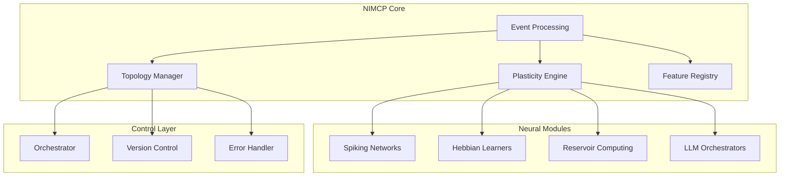

# NIMCP - Neuro-Inspired Modular Communication Protocol

## Overview
NIMCP (Neuro-Inspired Modular Communication Protocol) is a communication framework designed for heterogeneous, brain-inspired AI architectures. It supports asynchronous, event-driven, and sparse message passing between specialized computational modules (nodes), each potentially employing distinct neural and computational paradigms. Drawing inspiration from biological neural systems, it aims to foster energy-efficient operation, continuous adaptation through local plasticity, and graceful integration of diverse AI components.

## Core Features

### Asynchronous Communication
- Event-driven message passing
- No global synchronization requirements
- Sparse, efficient message formats
- Selective event subscription and delivery

### Neural Adaptation
- Local plasticity rules (Hebbian, STDP)
- Dynamic synaptic link modification
- Continuous weight adaptation
- Topology reconfiguration

### System Architecture


## Technical Requirements
- GCC 4.8+ or compatible C compiler
- POSIX-compliant system
- CMake 3.15+
- Optional: CUDA support for GPU acceleration
- Python 3.8+ for testing and simulation tools

## Quick Start

### Building from Source
```bash
git clone https://github.com/ai-elevate/nimcp.git
cd nimcp
mkdir build && cd build
cmake ..
make
```

### Basic Usage Example
```c
#include <nimcp.h>
#include <stdio.h>
#include <stdlib.h>

int main(void) {
    struct nimcp_context* ctx;
    struct nimcp_node_config cfg;
    nimcp_node_id_t node_id;
    int status;
    
    /* Initialize NIMCP context */
    ctx = nimcp_context_create();
    if (ctx == NULL) {
        fprintf(stderr, "Failed to create NIMCP context\n");
        return EXIT_FAILURE;
    }
    
    /* Configure node parameters */
    cfg.plasticity.learning_rate = 0.01f;
    cfg.plasticity.rule = NIMCP_PLASTICITY_HEBBIAN;
    cfg.plasticity.adaptation_threshold = 0.5f;
    cfg.events.batch_size = 64;
    cfg.events.max_queue_size = 1000;
    
    /* Create and initialize node */
    status = nimcp_node_create(ctx, &cfg, &node_id);
    if (status != NIMCP_SUCCESS) {
        fprintf(stderr, "Failed to create node\n");
        nimcp_context_destroy(ctx);
        return EXIT_FAILURE;
    }
    
    /* Start node operation */
    status = nimcp_node_start(ctx, node_id);
    if (status != NIMCP_SUCCESS) {
        fprintf(stderr, "Failed to start node\n");
        nimcp_node_destroy(ctx, node_id);
        nimcp_context_destroy(ctx);
        return EXIT_FAILURE;
    }
    
    /* Event processing loop */
    while (nimcp_should_continue(ctx)) {
        nimcp_process_events(ctx, node_id);
        nimcp_update_plasticity(ctx, node_id);
    }
    
    /* Cleanup */
    nimcp_node_destroy(ctx, node_id);
    nimcp_context_destroy(ctx);
    
    return EXIT_SUCCESS;
}
```

## Authors

### Original Author and Maintainer
- **Braun Brelin** (braun.brelin@ai-elevate.ai)
  - Protocol design and specification
  - Core implementation
  - Documentation

## Contributors
We welcome contributions! Current contributors:

- Initial development team at AI-Elevate
- Community contributions are welcome (see CONTRIBUTING.md)

## Roadmap

### Q4 2024
1. Core Protocol Implementation
   - Event packet processing system
   - Basic plasticity rules implementation
   - Node management and lifecycle
   - Initial testing framework

### Q1 2025
2. Advanced Features
   - Extended plasticity rules
   - Topology optimization
   - Distributed system support
   - Performance monitoring tools

### Q2 2025
3. Integration & Tools
   - Python bindings
   - Visualization tools
   - Example applications
   - Benchmark suite

### Q3 2025
4. Ecosystem Development
   - Additional neural paradigms
   - Cloud deployment support
   - Community tools
   - Extended documentation

### Future Plans
- Hardware acceleration support
- Advanced orchestration features
- Extended security features
- Cross-platform support improvements

## Version History
- v0.1.0 (2024-08)
  - Initial protocol specification
  - Core event processing
  - Basic plasticity rules

## Contact
- Email: braun.brelin@ai-elevate.ai

## License
MIT License

Copyright (c) 2024 AI-Elevate

Permission is hereby granted, free of charge, to any person obtaining a copy
of this software and associated documentation files (the "Software"), to deal
in the Software without restriction, including without limitation the rights
to use, copy, modify, merge, publish, distribute, sublicense, and/or sell
copies of the Software, and to permit persons to whom the Software is
furnished to do so, subject to the following conditions:

The above copyright notice and this permission notice shall be included in all
copies or substantial portions of the Software.

THE SOFTWARE IS PROVIDED "AS IS", WITHOUT WARRANTY OF ANY KIND, EXPRESS OR
IMPLIED, INCLUDING BUT NOT LIMITED TO THE WARRANTIES OF MERCHANTABILITY,
FITNESS FOR A PARTICULAR PURPOSE AND NONINFRINGEMENT. IN NO EVENT SHALL THE
AUTHORS OR COPYRIGHT HOLDERS BE LIABLE FOR ANY CLAIM, DAMAGES OR OTHER
LIABILITY, WHETHER IN AN ACTION OF CONTRACT, TORT OR OTHERWISE, ARISING FROM,
OUT OF OR IN CONNECTION WITH THE SOFTWARE OR THE USE OR OTHER DEALINGS IN THE
SOFTWARE.
